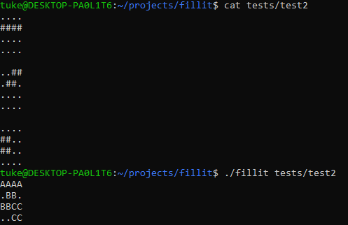
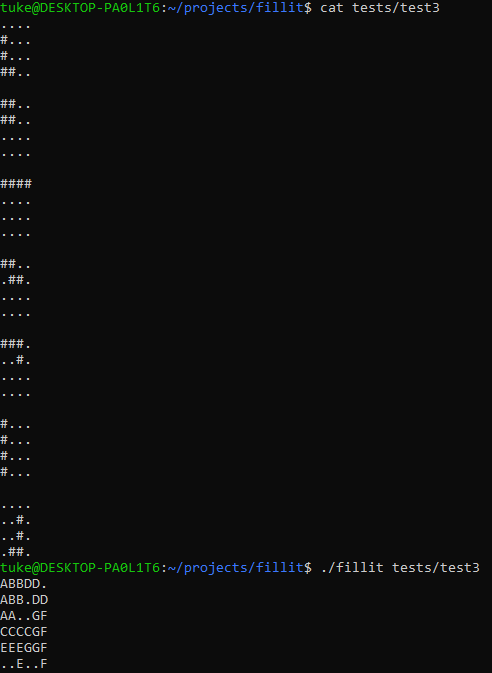

# 42-fillit
## Task
This project has been made with Antti Vornanen. Task is to create a program that will take a file as parameter, which contains a list of Tetrominos, and arrange them
in order to create the smallest square possible. Tetrominos are classic Tetris pieces composed of 4 blocks. In this case tetrominos will not be rotated and same piece rotated is considered as a different piece.
## Constraints
* Code must be complied with -Wall, -Wextra and -Werror flags.
* Only the following functions are allowed: exit, open, close, write, read, malloc and free.
## Solution
We solved this problem with the use of linked lists. We read the pieces from the file to a linked list, then calculate the smalles square possible, then start the following process.
1. For each piece calculate each possible position in the current square size.
2. Try to fit all the pieces to the square in a recursive backtracking manner.
3. If not successful, increase the square size by 1.
4. For each piece add new possible positions and go to step 2.

